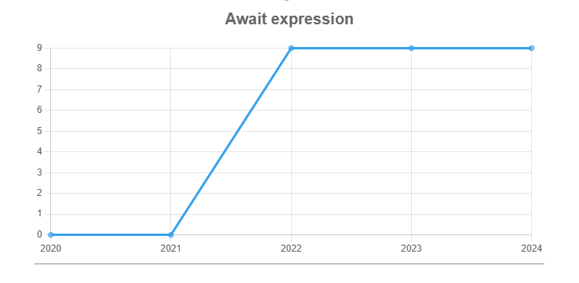

# Explorando evolução de código

Neste exercício, iremos explorar a evolução de código em sistemas reais.

Iremos utilizar a ferramenta [GitEvo](https://github.com/andrehora/gitevo).
Essa ferramenta analisa a evolução de código em repositórios Git nas seguintes linguagens: Python, JavaScript, TypeScript e Java.

Você deve submeter via Moodle apenas o link do seu `fork`, conforme descrito abaixo.

# Passo 1: Selecionar repositório a ser analisado

Selecione um repositório relevante na linguagem de sua preferência (Python, JavaScript, TypeScript ou Java).
Você pode encontrar projetos interessantes nos links abaixo:

- Python: https://github.com/topics/python?l=python
- JavaScript: https://github.com/topics/javascript?l=javascript
- TypeScript: https://github.com/topics/typescript?l=typescript
- Java: https://github.com/topics/java?l=java

# Passo 2: Instalar e rodar a ferramenta GitEvo

Instale a ferramenta [GitEvo](https://github.com/andrehora/gitevo) com o comando:

```
pip install gitevo
```

Rode a ferramenta no repositório selecionado através do seguinte comando (dependendo da linguagem do projeto que escolheu):

```shell
# Python
$ gitevo -r python <git_url>

# JavaScript
$ gitevo -r js <git_url>

# TypeScript
$ gitevo -r ts <git_url>

# Java
$ gitevo -r java <git_url>
```

Onde `<git_url>` é URL do repositório a ser analisado.
Por exemplo, para analisar o projeto Flask escrito em Python:

```
$ gitevo -r python https://github.com/pallets/flask
```

# Passo 3: Explorar os gráficos de evolução de código (`index.html`)

Ao rodar a ferramenta [GitEvo](https://github.com/andrehora/gitevo), o arquivo `index.html` é gerado com diversos gráficos de evolução de código.

Abra o arquivo `index.html` e observe com atenção os gráficos gerados.

# Passo 4: Explicar um gráfico de evolução de código

Selecione um dos gráficos de evolução e explique-o com suas palavras.
Por exemplo, você pode:

- Detalhar a evolução ao longo do tempo, 
- Detalhar se as curvas estão de acordo com boas práticas,
- Explicar grandes alterações nas curvas,
- Explorar a documentação do repositório em busca de explicações para grandes alterações
- Etc.

Seja criativo!

# Exercício

Para responder este exercício, primeiramente, você deve fazer um `fork` deste repositório.
No Moodle, você deve submeter apenas a URL do seu `fork`.

Em seguida, adicione o arquivo gerado `index.html` no seu fork.

Por fim, responda as questões abaixo no seu `fork`: 

1. Repositório selecionado: <https://github.com/airbnb/javascript>

2. Gráfico selecionado: **Await Expression**
  
3. Explicação: 

# 📊 Análise do Gráfico: `await` expression no repositório [airbnb/javascript](https://github.com/airbnb/javascript)

O gráfico mostra a evolução do uso da expressão `await` ao longo dos anos no repositório **airbnb/javascript**, que contém o guia de estilo JavaScript da Airbnb — um dos mais influentes da comunidade.

---



## 📈 Evolução temporal

- **De 2020 a 2021**: Uso de `await` era **zero**.  
- **Em 2022**: Salto repentino de **0 para 9 ocorrências** — adoção significativa da sintaxe `async/await`.  
- **De 2022 a 2024**: O número permanece constante, indicando uma **estabilização** na preferência por essa abordagem assíncrona.

---

## 🛠️ Justificativa técnica da mudança (baseada em commit real - https://github.com/airbnb/javascript/pull/2125/commits/debe04e1ea2396b162ddd689fbc9731d0ddb541c)

Mudança justificada pelo commit:

> **Commit:** `[eslint config] enforce modern usage of Promises`  
> **Comentário do autor (kripod):**  
> “Como a sintaxe `async/await` está se espalhando pelo ecossistema com suporte nativo do Node.js, navegadores e transpilers, ela pode ser preferida em vez de Promises.”

Essa justificativa demonstra uma motivação clara pela **modernização** e **simplificação** do código.

---

## 💬 Discussão no Pull Request

Dentro do mesmo Pull Request:

- **Comentário de `ljharb` (colaborador):**  
> "A sintaxe `await` é fácil de ser mal utilizada."  
> Além disso, alertou sobre os **custos** de adicionar novas regras do ESLint como peer dependencies, que são alterações **semver-major**.

### 🧩 Conclusão da discussão:

- Houve **debate técnico saudável** sobre vantagens e riscos do `await`.
- A mudança foi implementada com **cautela**, priorizando **legibilidade** e **alinhamento com o ecossistema moderno** de JavaScript.

---

## 📌 Interpretação do gráfico no contexto do repositório

O gráfico reflete uma escolha **intencional** de substituir Promises encadeadas (`.then()`) por `async/await` a partir de 2022. Essa decisão:

- Segue **boas práticas** de legibilidade e simplicidade.
- Acompanha a **evolução do suporte nativo** em navegadores, Node.js e ferramentas modernas.
- Demonstra a **influência de discussões internas** no projeto, conforme visto no PR.

---

## ✅ Resumo para o trabalho

O gráfico mostra um aumento súbito no uso da expressão `await` em 2022, refletindo uma **transição deliberada** no repositório da Airbnb para modernizar seu estilo de código JavaScript. Essa mudança foi discutida em Pull Requests e implementada por meio de **regras do ESLint**.

Apesar de haver **resistência inicial** quanto ao uso irrestrito de `await`, a decisão foi guiada por considerações de **clareza**, **suporte nativo** em ferramentas modernas e a **tendência natural do ecossistema** JavaScript. Desde então, o uso da sintaxe se estabilizou, indicando uma **consolidação** da escolha.

---

📝 *Trabalho acadêmico baseado em análise com GitEvo + histórico de PRs no GitHub.*


